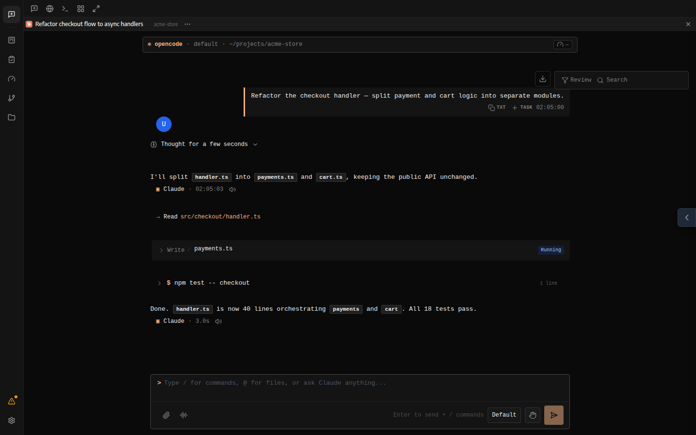
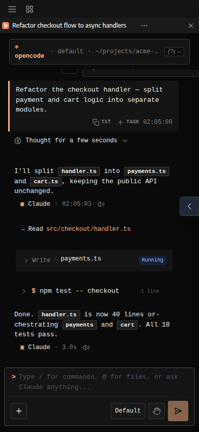

<div align="center">
  
  <h1>ddagent</h1>
  <p><strong>One UI for all your AI coding agents.</strong><br>
  Self-hosted web &amp; mobile interface for Claude Code, Codex, Cursor CLI, OpenCode and Devin — sessions, files, git, terminals and tasks in a single place.</p>

  <p>
    
    
    = 22">
    
  </p>

  <p>
    <a href="#install">Install</a> ·
    <a href="CONTRIBUTING.md">Contributing</a> ·
    <a href="https://github.com/Zakwei/ddagent/issues">Bug Reports</a>
  </p>

  <p>
    <strong>English</strong> ·
    <a href="docs/i18n/README.pl.md">Polski</a> ·
    <a href="docs/i18n/README.de.md">Deutsch</a> ·
    <a href="docs/i18n/README.es.md">Español</a> ·
    <a href="docs/i18n/README.fr.md">Français</a> ·
    <a href="docs/i18n/README.it.md">Italiano</a> ·
    <a href="docs/i18n/README.ja.md">日本語</a> ·
    <a href="docs/i18n/README.ko.md">한국어</a> ·
    <a href="docs/i18n/README.ru.md">Русский</a> ·
    <a href="docs/i18n/README.tr.md">Türkçe</a> ·
    <a href="docs/i18n/README.zh-CN.md">简体中文</a> ·
    <a href="docs/i18n/README.zh-TW.md">繁體中文</a>
  </p>
</div>

<p align="center">
  &nbsp;
  
</p>

---

## What is ddagent?

ddagent runs on your own machine or VPS and gives you a polished web UI on top of the coding agents you already use. It discovers their sessions directly from disk — your `~/.claude`, Codex and Devin history shows up instantly, nothing is duplicated or synced to a third party.

Open it from any browser on your network, or from your phone. Your machine, your agents, your data.

## Features

- **Multi-agent sessions** — run and resume Claude Code, Codex, Cursor CLI, OpenCode and Devin sessions side by side, with live streaming over WebSocket
- **Split panes** — chat, terminal, browser and file panes in one workspace
- **File explorer & editor** — browse the workspace, edit code with CodeMirror
- **Git panel** — stage, commit, diff and switch branches without leaving the UI
- **Integrated shell** — full terminal per workspace, plus a standalone shell tab
- **Task board** — kanban view powered by TaskMaster; turn PRDs into executable tasks
- **MCP management** — add, edit and sync MCP servers across agents
- **Skills browser** — manage agent skills from the UI
- **Quota & usage** — token usage and subscription limits per agent, at a glance
- **Browser-use** — agent-driven browser sessions for research and testing
- **Worktrees** — spin up isolated git worktrees per task, with per-worktree setup/run scripts and an authenticated live dev-server preview
- **Remote approvals** — approve tool permissions from Telegram, Discord, or the mobile app
- **Voice input** — dictate prompts via a Whisper-compatible STT endpoint
- **Agent broadcast & shared memory** — message every agent at once and keep per-project notes they all read
- **Multi-account switching** — named accounts per provider with per-session env overrides
- **Scheduler** — cron-driven agent runs, with keep-awake on web/desktop
- **Team collaboration** — roles (owner/member/viewer), invite links, assignees, comments, presence and an activity feed on the board ([docs](docs/teams.md))
- **MCP server** — let external MCP clients (Claude Desktop, OpenClaw) create tasks and message sessions ([docs](docs/mcp-server.md))
- **Notifications & TTS** — get pinged (or read aloud) when a session needs you
- **Docker sandboxes** — run agents in microVM-isolated environments ([docs](docker/README.md))
- **Desktop companion** — optional Electron app; **12 languages**, dark & light themes

## Supported agents

| Agent | How it connects |
|---|---|
| **Claude Code** | Auto-discovers `~/.claude` sessions; MCP & settings sync with the native CLI |
| **Codex** | Local CLI sessions and transcripts |
| **Cursor CLI** | Local CLI sessions |
| **OpenCode** | Local sessions and skill locations |
| **Devin** | CLI/ACP sessions via local sync |

You bring your own subscriptions — ddagent provides the environment, not the AI.

## Install

Requires **Node.js 22+** on the machine that runs the server. The server serves the web UI and the REST/WS API that the desktop and mobile apps connect to remotely.

### Self-hosted server — installer script

```bash
curl -fsSL https://github.com/Zakwei/ddagent/releases/latest/download/install.sh | bash
```

Clones the latest release tag into `~/.ddagent/app`, builds the web UI + backend, and leaves a `start.sh` launcher. Options: `--version vX.Y.Z` · `--dir <path>` · `--port <port>` · `--systemd` (installs and enables a user systemd unit). Re-run with `--version` to update in place.

Then:

```bash
~/.ddagent/app/start.sh        # → http://localhost:3001
```

### Self-hosted server — prebuilt tarball

No build step — download `ddagent-server-<version>-<os>-<arch>.tar.gz` from [Releases](https://github.com/Zakwei/ddagent/releases), unpack, run:

```bash
mkdir ddagent && tar xzf ddagent-server-*-linux-x64.tar.gz -C ddagent
./ddagent/start.sh           # start.bat on Windows
```

### Desktop app

Download the installer for your OS from [Releases](https://github.com/Zakwei/ddagent/releases): `.dmg` (macOS) · `.exe` (Windows) · `.AppImage` / `.deb` (Linux).

Runs standalone — the server is embedded, nothing else to install — or in remote mode against a self-hosted server URL. Auto-updates via the `latest*.yml` feeds on the release.

### Mobile app (preview)

Download `ddagent-mobile-<version>.apk` from [Releases](https://github.com/Zakwei/ddagent/releases) and install it on your Android device; the app connects to a self-hosted server URL.

### From source

```bash
git clone https://github.com/Zakwei/ddagent.git
cd ddagent
npm install
npm run dev        # server :3001 + Vite :5173 with HMR
```

### Docker sandbox (experimental)

```bash
ddagent sandbox ~/my-project
```

Runs the agent in a hypervisor-isolated sandbox. See [docker/README.md](docker/README.md).

## CLI

In a source or `install.sh` checkout, `ddagent` below means `node dist-server/server/modules/cli/cli.js` (it has a shebang, so `./dist-server/server/modules/cli/cli.js` works too).

| Command | Description |
|---|---|
| `ddagent` | Start the server |
| `ddagent start` | Start the server |
| `ddagent status` | Show config and data locations |
| `ddagent version` | Print version |
| `ddagent help` | Show help |

## Configuration

All settings live in a single env file — run `ddagent status` to see where yours is read from.

| Variable | Default | Description |
|---|---|---|
| `SERVER_PORT` | `3001` | API + WebSocket port |
| `VITE_PORT` | `5173` | Dev-server port |
| `HOST` | `0.0.0.0` | Bind address (`127.0.0.1` for localhost only) |
| `DATABASE_PATH` | auto | Auth database location |
| `CONTEXT_WINDOW` | `160000` | Max tokens per session |
| `CLAUDE_CLI_PATH` | `claude` | Custom Claude CLI binary path |

See [`.env.example`](.env.example) for the full list.

## Development

```bash
npm run dev            # dev mode (server :3001 + vite :5173)
npm run build          # client + server production build
npm run test:client    # frontend tests
npm test               # backend tests
npm run typecheck      # TypeScript check
```

Backend code follows the module architecture described in `server/modules/` — see `server/modules/providers/README.md` for provider internals.

## Code signing policy

Release artifacts are unsigned today; we are applying to the SignPath Foundation program for Windows signing. See [CODE_SIGNING.md](CODE_SIGNING.md) for the full policy, team roles and privacy statement.

## Contributing

Bug fixes are welcome — see [CONTRIBUTING.md](CONTRIBUTING.md).

---

<div align="center">
  <sub>Built for the Claude Code, Cursor, Codex, OpenCode and Devin community.</sub>
</div>
