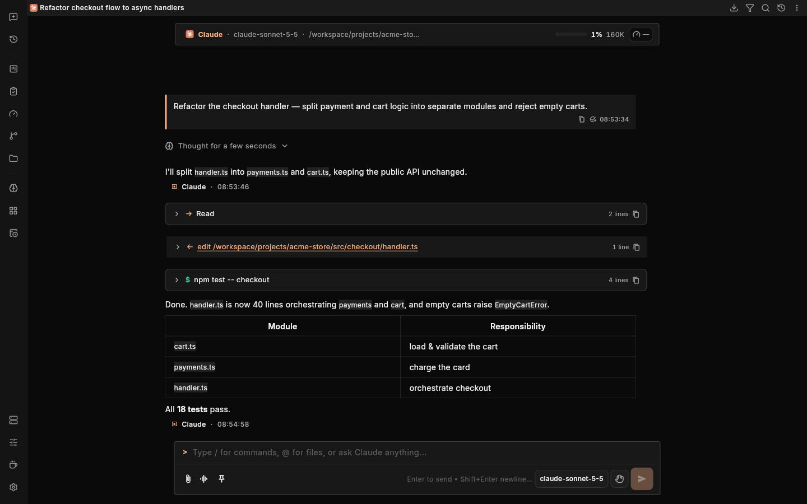
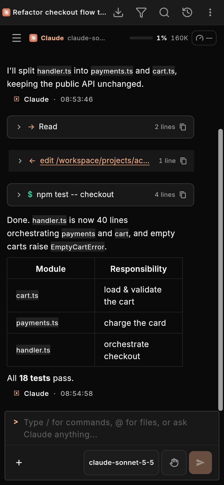
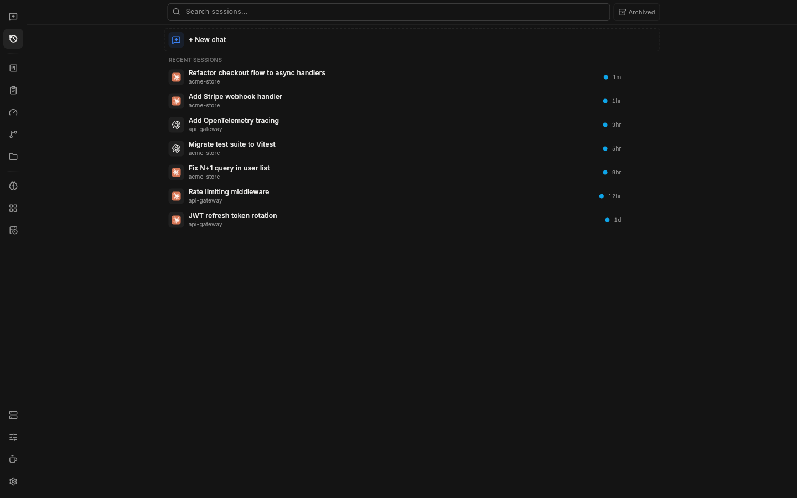
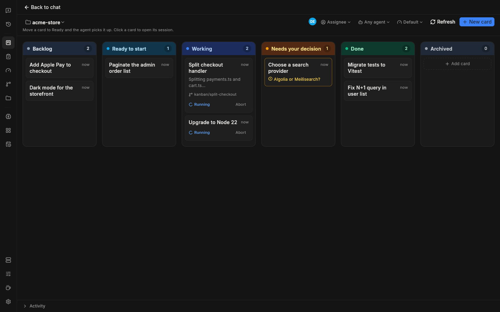
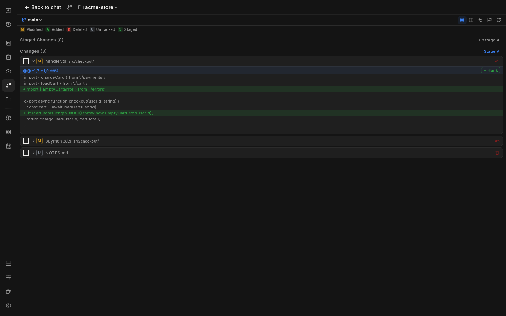

<div align="center">
  
  <h1>ddagent</h1>
  <p><strong>One UI for all your AI coding agents.</strong><br>
  Self-hosted server and Flutter client (web, Linux, Windows &amp; Android) for Claude Code, Codex, Cursor CLI, OpenCode, Devin, Command Code and Antigravity — sessions, files, git, terminals and tasks in a single place.</p>

  <p>
    
    
    = 22">
    
  </p>

  <p>
    <a href="#install">Install</a> ·
    <a href="CONTRIBUTING.md">Contributing</a> ·
    <a href="https://github.com/Zakwei/ddagent/issues">Bug Reports</a>
  </p>

  <p>
    <strong>English</strong> ·
    <a href="docs/i18n/README.pl.md">Polski</a> ·
    <a href="docs/i18n/README.de.md">Deutsch</a> ·
    <a href="docs/i18n/README.es.md">Español</a> ·
    <a href="docs/i18n/README.fr.md">Français</a> ·
    <a href="docs/i18n/README.it.md">Italiano</a> ·
    <a href="docs/i18n/README.ja.md">日本語</a> ·
    <a href="docs/i18n/README.ko.md">한국어</a> ·
    <a href="docs/i18n/README.ru.md">Русский</a> ·
    <a href="docs/i18n/README.tr.md">Türkçe</a> ·
    <a href="docs/i18n/README.zh-CN.md">简体中文</a> ·
    <a href="docs/i18n/README.zh-TW.md">繁體中文</a>
  </p>
</div>

<p align="center">
  &nbsp;
  
</p>

<table>
  <tr>
    <td width="33%"></td>
    <td width="33%"></td>
    <td width="33%"></td>
  </tr>
  <tr>
    <td align="center"><sub>Sessions from every agent in one list</sub></td>
    <td align="center"><sub>Kanban board — cards start agent runs</sub></td>
    <td align="center"><sub>Git panel — diff, stage hunks, commit</sub></td>
  </tr>
</table>

---

## What is ddagent?

ddagent runs on your own machine or VPS and puts one polished UI on top of the coding agents you already use. The server reads each agent's sessions straight from its own on-disk history (`~/.claude`, `~/.codex`, `~/.cursor`, OpenCode, Devin, …), so existing conversations show up without importing anything. Only session metadata is indexed locally; nothing is sent to a third party.

Connect from the Flutter client on your desktop, phone or browser. Your machine, your agents, your data.

## Features

- **Multi-agent sessions** — run and resume sessions from seven agent CLIs side by side, with live streaming over WebSocket
- **Auto orchestrator** — "Auto" sessions route each task to a suitable agent and model, taking remaining subscription quota into account, and delegate work to child sessions
- **Split workspace** — up to six panes (chat, terminal, browser, preview, editor, git, notes) in one window
- **File explorer & editor** — browse the workspace and edit code in the built-in editor
- **Git panel** — stage files or individual hunks, commit (with AI-generated messages), diff, branch, pull/push and restore checkpoints without leaving the UI
- **Integrated terminal** — a full shell per workspace
- **Kanban board** — move a card to start an agent run on it (optionally in its own worktree); the agent reports back when it is done
- **TaskMaster** — turn PRDs into tasks and track them on a task board
- **Message queue** — messages sent while an agent is busy are queued on the server and survive refreshes and device switches
- **MCP management** — add, edit and sync MCP servers across agents
- **Knowledge base** — one local, searchable memory for every agent: rules, skills, memories and personal info, retrieved on demand over MCP ([docs](docs/KNOWLEDGE.md))
- **Skills & rules** — manage agent skills and shared rules from one place
- **Quota & usage** — token usage and subscription limits per agent, at a glance
- **Browser-use** — agent-driven browser sessions for research and testing, with a live browser pane
- **Worktrees** — spin up isolated git worktrees per task, with per-worktree setup/run scripts and an authenticated live dev-server preview
- **Remote approvals** — approve tool permissions from Telegram, Discord or the Android app ([docs](docs/remote-approvals.md))
- **Voice input** — dictate prompts through a Whisper-compatible speech-to-text endpoint
- **Agent broadcast & shared memory** — message every agent at once and keep per-project notes they all read
- **Multi-account switching** — named accounts per provider with per-session env overrides
- **Scheduler** — cron-driven, unattended agent runs, with an option to keep the device awake while runs are active
- **Team collaboration** — roles (owner/member/viewer), invite links, assignees, comments, presence and an activity feed on the board ([docs](docs/teams.md))
- **MCP server** — let external MCP clients (Claude Desktop, OpenClaw) list sessions, create tasks and message sessions ([docs](docs/mcp-server.md))
- **Notifications & TTS** — push, Telegram and Discord notifications when a session needs you, plus optional read-aloud replies
- **Command palette** — `Ctrl/Cmd+Shift+K` to search sessions and messages, jump to any page or run quick actions
- **Docker sandboxes** — run agents in microVM-isolated Docker Sandboxes ([docs](docker/README.md))
- **Flutter client** — one codebase for web, Linux, Windows and Android; **12 languages**, dark and light themes

## Supported agents

| Agent | How it connects |
|---|---|
| **Claude Code** | Claude Agent SDK; auto-discovers `~/.claude` sessions; MCP and settings sync with the native CLI |
| **Codex** | Codex SDK; local sessions and transcripts from `~/.codex` |
| **Cursor CLI** | `cursor-agent` with streaming JSON output; local chats from `~/.cursor` |
| **OpenCode** | `opencode serve`; local sessions from the OpenCode database |
| **Devin** | `devin acp` (Agent Client Protocol); local transcripts |
| **Command Code** | `command-code acp` (Agent Client Protocol); transcripts from `~/.commandcode` |
| **Antigravity** | `agy` CLI in headless mode; conversations indexed from `~/.gemini/antigravity-cli` |

The agent CLIs must be installed and signed in on the server machine. You bring your own subscriptions — ddagent provides the environment, not the AI.

## Install

ddagent has two parts: the **server**, which runs next to your agents and exposes a REST/WebSocket API, and the **client**, which connects to it. The server needs **Node.js 22+** (the prebuilt tarballs need Node.js 22.x, because their native modules are built against it).

### Server — installer script

```bash
curl -fsSL https://github.com/Zakwei/ddagent/releases/latest/download/install.sh | bash
```

Requires `git`, Node.js 22+ and `npm`. The script clones a release tag into `~/.ddagent/app`, installs dependencies, builds the backend and writes a `start.sh` launcher. Pass options after `bash -s --`:

| Option | Description |
|---|---|
| `--version vX.Y.Z` | Install a specific release (default: latest) |
| `--dir <path>` | Install directory (default: `~/.ddagent/app`) |
| `--systemd` | Install and enable a systemd user service named `ddagent` |
| `--port <port>` | Port for the systemd service (default: `3001`) |

```bash
curl -fsSL https://github.com/Zakwei/ddagent/releases/latest/download/install.sh | bash -s -- --systemd --port 3001
```

Then start the server:

```bash
~/.ddagent/app/start.sh        # API on http://<host>:3001 (set SERVER_PORT to change)
```

### Server — prebuilt tarball

No build step: download `ddagent-server-<version>-<os>-<arch>.tar.gz` (`linux-x64`, `mac-arm64` or `win-x64`) from [Releases](https://github.com/Zakwei/ddagent/releases), unpack it and run the launcher:

```bash
mkdir ddagent && tar xzf ddagent-server-*-linux-x64.tar.gz -C ddagent
./ddagent/start.sh             # start.bat on Windows
```

Each tarball comes with a `.sha256` checksum. Settings go in an optional `.env` file next to `start.sh`.

### Client

Download a prebuilt client from [Releases](https://github.com/Zakwei/ddagent/releases):

| Platform | Asset |
|---|---|
| Windows x64 | `ddagent-flutter-windows-x64-<tag>-setup.exe` (installer) or `.zip` (portable) |
| Linux x64 | `ddagent-flutter-linux-x64-<tag>.deb` or `.tar.gz` |
| Android | `ddagent-flutter-android-<tag>.apk` |
| Web | `ddagent-flutter-web-<tag>.zip` |

On first launch, enter your server URL (for example `http://my-vps:3001`) and create the first account. On Windows and Linux x64, the desktop client can also download and run a local server for you ("This device" on the connect screen).

The web build has no login screen and calls the API on its own origin, so it must be served behind a reverse proxy in front of a server running in single-user platform mode (`VITE_IS_PLATFORM=true`, which disables authentication). In a source checkout, `node scripts/serve-flutter-web.cjs` serves `flutter/build/web` on port 8085 and proxies the API and WebSockets to the server on `FLUTTER_BACKEND_PORT` (default `10087`). Only expose this setup on a trusted network.

To build the client yourself:

```bash
cd flutter
flutter pub get
flutter build linux --release      # or: windows, apk, web
```

### Updating

**Settings → About → Updates** in the client has a separate button for each part:

| Part | How it updates |
|---|---|
| **Server** | Installer-script and git installs move to the newest release; release tarballs download, verify (`.sha256`) and install the next tarball on restart, and roll back automatically if it fails to start. `start.sh` / `start.bat` restart the server on their own — no systemd needed. A desktop client's local server ("This device") is re-installed by the app. |
| **Web interface** | Replaced from the release web zip when the server hosts it (`DDAGENT_WEB_DIR`, or `flutter/build/web` served by `scripts/serve-flutter-web.cjs`); it is also refreshed with every server update. |
| **This app** | Android installs the new APK; Windows and Linux download the new build in the background and install it when you quit. |

Release tarballs are built for Node.js 22 — the server refuses a tarball built for a different Node.js major. Servers from 0.8.12 or older (installer script or tarball) update to 0.8.13 once by hand — re-run `install.sh --version v0.8.13` or unpack the new tarball over the old one — and from the UI after that.

### From source

```bash
git clone https://github.com/Zakwei/ddagent.git
cd ddagent
npm install
npm run build && node dist-server/server/index.js   # API on http://localhost:3001
```

### Docker sandbox (experimental)

```bash
ddagent sandbox ~/my-project
```

Runs ddagent and an agent (Claude Code or Codex) inside a microVM-isolated Docker Sandbox. Requires the `sbx` CLI — see [docker/README.md](docker/README.md).

## CLI

In a source or `install.sh` checkout, `ddagent` below means `node dist-server/server/modules/cli/cli.js` (it has a shebang, so `./dist-server/server/modules/cli/cli.js` works too).

| Command | Description |
|---|---|
| `ddagent` / `ddagent start` | Start the server (default command) |
| `ddagent status` | Show version, config file, database and Claude projects locations |
| `ddagent sandbox <workspace>` | Create and start a Docker sandbox; `ddagent sandbox help` lists `ls`, `start`, `stop`, `rm`, `logs` |
| `ddagent browser-use-mcp` | Run the browser-use MCP server over stdio |
| `ddagent version` | Print the version |
| `ddagent help` | Show help |

| Option | Description |
|---|---|
| `-p, --port <port>` | Server port (overrides `SERVER_PORT`) |
| `--database-path <path>` | Custom database location (overrides `DATABASE_PATH`) |

## Configuration

The server reads an optional `.env` file from its install directory (next to `start.sh`); real environment variables take precedence. Run `ddagent status` to see which file is used.

| Variable | Default | Description |
|---|---|---|
| `SERVER_PORT` | `3001` | API + WebSocket port (`PORT` is accepted as a legacy alias) |
| `HOST` | `0.0.0.0` | Bind address (`127.0.0.1` for localhost only) |
| `DATABASE_PATH` | `~/.ddagent/auth.db` | SQLite database (users, settings, tokens) |
| `WORKSPACES_ROOT` | home directory | Projects must live inside this directory |
| `JWT_SECRET` | auto-generated | Secret for signing login tokens (generated and stored per installation) |
| `API_KEY` | unset | When set, API requests must send it in the `x-api-key` header |
| `CLAUDE_CLI_PATH` | `claude` | Custom Claude Code CLI binary |
| `CONTEXT_WINDOW` | `200000` | Claude context window fallback, used until the SDK reports the model's real window |
| `STT_ENDPOINT_URL` / `STT_API_KEY` / `STT_MODEL` | `https://api.openai.com/v1` / unset / `whisper-1` | Speech-to-text for voice input (also configurable in Settings) |
| `VITE_IS_PLATFORM` | `false` | Single-user platform mode: skips authentication (required by the web client) |

See [`.env.example`](.env.example) for more.

## Development

```bash
npm install
npm run dev               # start the backend from source (tsx, no reload)
npm run server:dev-watch  # same, restarting on file changes
npm run build             # compile the server to dist-server/
npm test                  # backend tests
npm run typecheck         # TypeScript check
npm run lint              # ESLint
```

Client (Flutter 3.47.5 stable):

```bash
cd flutter
flutter pub get
flutter run -d linux --dart-define=DEFAULT_SERVER_URL=http://localhost:3001
dart format --line-length 100 lib test
flutter analyze
flutter test
```

Backend code follows the module architecture in `server/modules/`; see [`server/modules/providers/README.md`](server/modules/providers/README.md) for provider internals.

## Contributing

Bug fixes are welcome — see [CONTRIBUTING.md](CONTRIBUTING.md). To report a vulnerability, see [SECURITY.md](SECURITY.md).

---

<div align="center">
  <sub>Built for the Claude Code, Codex, Cursor, OpenCode, Devin, Command Code and Antigravity community.</sub>
</div>
